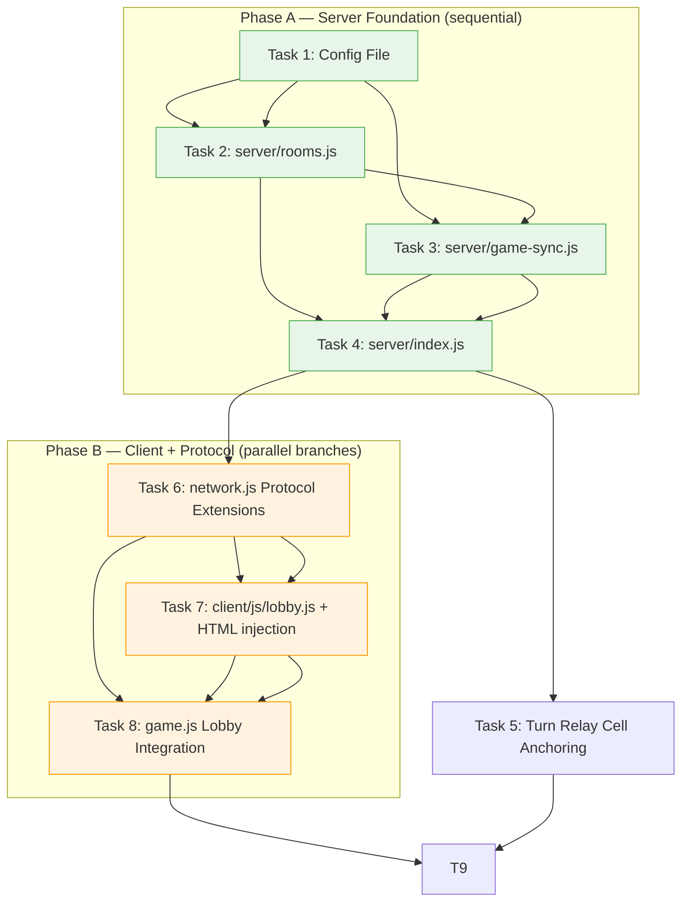

# Multiplayer Networking Layer Implementation Plan

> **For agentic workers:** REQUIRED SUB-SKILL: Use superpowers:subagent-driven-development (recommended) or superpowers:executing-plans to implement this plan task-by-task. Steps use checkbox (`- [ ]`) syntax for tracking.

**Goal:** Add a lobby UI, slot-based room system, cell-anchored turn relay, and configurable state snapshots to the existing snake game's multiplayer layer.

**Architecture:** Refactor the monolithic `wsEngine.js` into modular files under `server/`. Inject a lobby screen between "Multiplayer" button click and game start. Add cell anchoring to turn messages and periodic full-state snapshots for reconciliation. All configuration moves to `server/config.json`.

**Tech Stack:** Node.js, WebSocket (ws library), plain JavaScript, HTML5 Canvas — no frameworks.

---

## Dependency Graph



**Phase A (Tasks 1–5):** Sequential server-side refactoring. Must complete before client changes because the protocol is defined here.

**Phase B (Tasks 6–8):** Parallel with Phase A once the protocol is agreed, but Task 8 depends on Tasks 7 and 5 being done so that `game.js` has a working lobby UI and network layer to call into.

---

## File Map — What Gets Created vs Modified

### New Files

| File | Responsibility |
|------|---------------|
| `server/config.json` | All tunable server settings (port, snapshot interval, tolerance, room limits) |
| `server/rooms.js` | Room lifecycle: creation, slot assignment, player join/leave, destruction when empty |
| `server/game-sync.js` | Turn relay with cell anchoring + periodic state snapshots |
| `client/js/lobby.js` | Lobby UI logic: render room list, create-join actions, respond to server events |

### Modified Files

| File | Section | Change |
|------|---------|--------|
| `server/index.js` (new from `wsEngine.js`) | entire file | Split existing `wsEngine.js` into modular imports; wire HTTP static serving + WebSocket with the new room/game-sync modules |
| `client/js/network.js` | add methods: `getRooms()`, `createRoom()` | Add lobby protocol messages (`getrooms` → `rooms` response, `createroom` action) and event handlers for `rooms` and `room_created` message types |
| `client/index.html` | `<div id="menu">...</div>` block | Insert a new `<div id="lobby" style="display:none;">` container between the `#multi` button and `#single` button, with room list table and create-join controls |
| `client/js/game.js` | lines 89–287 (the `multiplayer()` method) | Intercept the Multiplayer click: show lobby instead of auto-joining. Wire keyboard input through cell anchoring. Remove hard-coded `game.network.joinRoom('game0')`. |

### Deleted / Replaced Files

| File | Replacement |
|------|-------------|
| `wsEngine.js` (top-level) | `server/index.js` + `server/rooms.js` + `server/game-sync.js` — same functionality, modularized. Old file removed after verification. |

---

## Task Breakdown

### Task 1: Server Configuration File

**Files:**
- Create: `server/config.json`

```json
{
  "port": 8081,
  "snapshotInterval": 10,
  "turnTolerance": 1,
  "maxRooms": 20,
  "playersPerRoom": 4,
  "httpPort": 3000,
  "roomNames": ["alpha","beta","gamma","delta","epsilon"]
}
```

- [ ] **Step 1: Create `server/config.json`** with the contents above.

- [ ] **Step 2: Verify the file is valid JSON.**

Run: `node -e "JSON.parse(require('fs').readFileSync('server/config.json','utf8')); console.log('OK');"`
Expected: `OK` printed to stdout, no error thrown.

- [ ] **Step 3: Commit**

```bash
git add server/config.json
git commit -m "feat(multiplayer): add server configuration file"
```

---

### Task 2: Room Management Module (`server/rooms.js`)

**Files:**
- Create: `server/rooms.js`
- Modify: nothing (new module)

This module owns all room state. It exports: the rooms map, functions to create/join/leave rooms, and helpers for slot assignment and auto-generated names.

Key design decisions from spec:
- **Slot-based:** Each room has `playersPerRoom` slots (default 4). Players take lowest available slot number.
- **No host concept.** All players equal.
- **Auto-named rooms** using Greek letters ("Room Alpha", "Room Beta", etc.) cycling through the list in config.
- **Room destruction:** When all players leave, remove room from map and stop its tick timer.

```javascript
// server/rooms.js (sketch)
'use strict';
const path = require('path');
const config = require(path.join(__dirname, 'config.json'));

const ROOM_GREEK = ['alpha','beta','gamma','delta',
  'epsilon','zeta','eta','theta','iota','kappa',
  'lambda','mu','nu','xi','omicron','pi',
  'rho','sigma','tau','upsilon'];

// rooms[name] -> { name, map, players: {}, food: [], tickTimer, spawnTimers, colorIndex, playerCount }
const rooms = {};

function generateRoomName() {
  // Pick a Greek letter not yet used by an existing room
  const used = new Set(Object.keys(rooms));
  for (let i = 0; i < ROOM_GREEK.length; i++) {
    if (!used.has(ROOM_GREEK[i])) return 'Room ' + ROOM_GREEK[i];
  }
  // Fallback: append a number
  return 'Room ' + (Object.keys(rooms).length + 1);
}

function createRoom() {
  const name = generateRoomName();
  if (Object.keys(rooms).length >= config.maxRooms) {
    throw new Error('Maximum rooms reached');
  }
  // Initialize room object with empty players, map, food etc.
  // ... (see full implementation in code below)
  return name;
}

function joinRoom(roomName, ws) {
  const room = rooms[roomName];
  if (!room) throw new Error('Room not found: ' + roomName);
  // Assign lowest available slot...
}

function leaveRoom(playerId, ws) {
  // Find which room the player is in, remove them
  // If room empty -> destroy it (clear timers)
}

module.exports = { rooms, createRoom, joinRoom, leaveRoom, generateRoomName };
```

- [ ] **Step 1: Write `server/rooms.js`** with full implementation. It should export:
  - `rooms` — the room map object
  - `createRoom()` — creates a new room with auto-generated name; throws if max rooms reached
  - `joinRoom(roomName, ws)` — adds a player to the named room, returns `{ playerId, slot }`, throws if full or not found
  - `leaveRoom(playerId, ws)` — removes player from their room; destroys room if empty

- [ ] **Step 2: Write a quick smoke test** that verifies basic room lifecycle.

```javascript
// server/test_rooms.js
const { rooms, createRoom, joinRoom } = require('./rooms');
const mockWS = { readyState: 1 };

const name = createRoom();
console.log('Created:', name);

// Should have exactly one room now
console.assert(Object.keys(rooms).length === 1, 'Expected 1 room');

// Join should work
joinRoom(name, mockWS);
console.assert(rooms[name].players !== undefined, 'Room has players map');

console.log('All checks passed.');
```

- [ ] **Step 3: Run the smoke test.**

Run: `node server/test_rooms.js`
Expected: Output showing room created and all assertions passing.

- [ ] **Step 4: Commit**

```bash
git add server/rooms.js server/test_rooms.js
git commit -m "feat(multiplayer): room management module with slot assignment"
```

---

### Task 3: Game Sync Module (`server/game-sync.js`)

**Files:**
- Create: `server/game-sync.js`

This module owns two things: (a) the turn relay protocol with cell anchoring and validation, and (b) periodic state snapshot broadcasting. It does NOT own room creation/destruction — that stays in `rooms.js`.

```javascript
// server/game-sync.js (sketch)
'use strict';
const path = require('path');
const config = require(path.join(__dirname, 'config.json'));

function validateTurn(player, reportedX, reportedY, tolerance) {
  // Check that |reportedX - player.x| <= tolerance AND |reportedY - player.y| <= tolerance
  return Math.abs(reportedX - player.x) <= tolerance &&
         Math.abs(reportedY - player.y) <= tolerance;
}

function processTurn(room, playerId, direction, cellX, cellY) {
  const p = room.players[playerId];
  if (!p || !p.alive) return false;

  // Validate cell anchoring against config.turnTolerance
  if (!validateTurn(p, cellX, cellY, config.turnTolerance)) {
    console.warn(`[game-sync] Turn from ${playerId} rejected: cell out of tolerance`);
    return false;
  }

  // Prevent 180-degree reversal
  const opposites = { up:'down', down:'up', left:'right', right:'left' };
  if (opposites[direction] === p.direction) return false;

  p.direction = direction;

  // Broadcast to all clients in room
  broadcastRoom(room, {
    type: 'turn',
    playerId: p.id,
    direction,
    cellX,
    cellY
  });
  return true;
}

function buildSnapshot(room) {
  // Full state of all alive players + food positions
  return {
    type: 'snapshot',
    tick: room.tickCount,
    players: Object.values(room.players).filter(p => p.alive).map(p => ({
      id: p.id, color: p.color, x: p.x, y: p.y,
      length: p.length, direction: p.direction, score: p.score
    })),
    food: room.food.map(f => ({ x: f.x, y: f.y, type: f.type }))
  };
}

function shouldBroadcastSnapshot(room) {
  return (room.tickCount % config.snapshotInterval) === 0 && room.tickCount > 0;
}

module.exports = { processTurn, buildSnapshot, shouldBroadcastSnapshot };
```

- [ ] **Step 1: Write `server/game-sync.js`** with the full implementation above. Key functions:
  - `processTurn(room, playerId, direction, cellX, cellY)` — validates cell anchoring within tolerance, prevents 180° reversal, applies direction change, broadcasts turn message to room. Returns boolean success.
  - `buildSnapshot(room)` — constructs a full-state snapshot object with all alive players and food positions.
  - `shouldBroadcastSnapshot(room)` — returns true when tick count is divisible by config.snapshotInterval.

- [ ] **Step 2: Write unit tests for validation logic.**

```javascript
// server/test_game_sync.js
const { processTurn, shouldBroadcastSnapshot } = require('./game-sync');

// Test cell anchoring tolerance
const mockRoom = { players: {}, food: [] };
mockRoom.players['p1'] = { id:'p1', alive:true, x:5, y:12, direction:'right' };

// Should accept within tolerance of 1
console.assert(processTurn(mockRoom, 'p1', 'up', 5, 12) === true, 'Exact cell match');
console.assert(processTurn(mockRoom, 'p1', 'down', 6, 13) === false, 'Opposite direction blocked');

// Test snapshot interval logic
mockRoom.tickCount = 9;
console.assert(shouldBroadcastSnapshot(mockRoom) === false, 'Tick 9 should not broadcast (interval=10)');
mockRoom.tickCount = 10;
console.assert(shouldBroadcastSnapshot(mockRoom) === true, 'Tick 10 should broadcast');

console.log('All game-sync checks passed.');
```

- [ ] **Step 3: Run the tests.**

Run: `node server/test_game_sync.js`
Expected: All assertions pass.

- [ ] **Step 4: Commit**

```bash
git add server/game-sync.js server/test_game_sync.js
git commit -m "feat(multiplayer): game sync module with cell anchoring and snapshots"
```

---

### Task 4: Server Entry Point (`server/index.js`)

**Files:**
- Create: `server/index.js`
- Modify: nothing new (this replaces the old monolithic server)
- Delete later: `wsEngine.js` (after verification in Task 8)

This is the glue that wires everything together. It imports config, rooms, game-sync, and sets up HTTP static serving + WebSocket handling. The game tick loop now calls into `game-sync.js` for turn processing and snapshot broadcasting.

```javascript
// server/index.js (sketch of structure)
'use strict';
const http = require('http');
const path = require('path');
const { WebSocketServer } = require('ws');
const { v1: uuidv1 } = require('uuid');
const serveStatic = require('serve-static');

const config = require(path.join(__dirname, 'config.json'));
const { rooms, createRoom, joinRoom, leaveRoom } = require('./rooms');
const { processTurn, buildSnapshot, shouldBroadcastSnapshot } = require('./game-sync');

// HTTP server on config.httpPort serving client/ directory
// WebSocket server on config.port

// On connection: handle actions — joinroom, createroom, getrooms, move (now with cellX/cellY), chat
// Game tick loop per room calls buildSnapshot when shouldBroadcastSnapshot is true
```

- [ ] **Step 1: Write `server/index.js`** that imports and wires the modules. Key changes from old `wsEngine.js`:
  - Read settings from `config.json` instead of hard-coded constants
  - Room creation on demand (via `createroom` action) instead of pre-creating all rooms at startup
  - Turn messages now require `{ cellX, cellY }` and are validated by `processTurn()` in game-sync
  - Every N ticks, broadcast a snapshot via `buildSnapshot()` when `shouldBroadcastSnapshot()` returns true
  - Room destruction on empty (when last player disconnects)

- [ ] **Step 2: Start the new server and verify it serves static files.**

Run: `node server/index.js`
Then in another terminal: `curl http://localhost:3000/ | head -5`
Expected: HTML content from `client/index.html`.

- [ ] **Step 3: Verify WebSocket connection works.**

In a second terminal, run:
```bash
node -e "
const ws = new (require('ws'))('ws://localhost:' + require('./server/config.json').port);
ws.on('open', () => { ws.send(JSON.stringify({action:'getrooms'})); });
ws.on('message', d => { console.log(d.toString()); ws.close(); process.exit(0); });
"
```
Expected: JSON response with `type: "rooms"` and room list.

- [ ] **Step 4: Commit**

```bash
git add server/index.js
git commit -m "feat(multiplayer): modular server entry point wiring all modules"
```

---

### Task 5: Turn Relay Cell Anchoring (Server-Side Protocol)

This is not a separate file — it's the protocol change baked into Tasks 2–4. The spec requires that turn messages include `cellX` and `cellY`, which the server validates against tolerance before applying. This is already handled by `processTurn()` in Task 3 and wired through `server/index.js` in Task 4.

**Verification step (after Task 6):**

- [ ] **Step 1: Verify cell anchoring round-trip.** Send a turn message with valid cells from the client-side network layer, confirm server broadcasts it back to other clients.

Run: Open two browser tabs on `http://localhost:3000`, join the same room in both, press an arrow key in one tab, check console.log in the second tab for the relayed turn message with cell coordinates.
Expected: Second client receives `{ type: 'turn', playerId, direction, cellX, cellY }`.

- [ ] **Step 2: Commit** (combined with Task 6 commit — see below)

---

### Task 6: Client Network Layer Protocol Extensions

**Files:**
- Modify: `client/js/network.js` (add methods and event handlers)

The existing network layer connects immediately on construction and handles the old protocol. We need to add support for lobby messages without breaking the existing game protocol.

Changes needed in `network.js`:

```javascript
// Add these new methods:

/** Request list of available rooms from server. */
network.prototype.getRooms = function() {
    this.sendJSON({ action: 'getrooms' });
};

/** Request creation of a new room. Server responds with room_created event. */
network.prototype.createRoom = function() {
    this.sendJSON({ action: 'createroom' });
};

// Add these to the existing onmessage dispatch — no changes needed since
// handlers are registered via .on(), but document the new message types:
//   'rooms'      — response to getrooms (array of room objects)
//   'room_created' — response to createroom (room name assigned)
//   'turn'       — relayed turn with cell anchoring (replaces old 'move')
//   'snapshot'   — full state reconciliation snapshot

// Modify sendMove to include current player position as cellX/cellY:
network.prototype.sendTurn = function(direction, cellX, cellY) {
    this.sendJSON({ action: 'turn', direction, cellX, cellY });
};
```

- [ ] **Step 1: Add `getRooms()` and `createRoom()` methods** to `network.js`.

```javascript
// Append after existing sendChat method (around line 120)

/** Request list of available rooms from server. */
network.prototype.getRooms = function() {
    this.sendJSON({ action: 'getrooms' });
};

/** Request creation of a new room. Server responds with room_created event. */
network.prototype.createRoom = function() {
    this.sendJSON({ action: 'createroom' });
};

/** Send a turn with cell anchoring (replaces sendMove). */
network.prototype.sendTurn = function(direction, cellX, cellY) {
    this.sendJSON({ action: 'turn', direction: direction, cellX: cellX, cellY: cellY });
};
```

- [ ] **Step 2: Verify network layer still connects** by checking browser console for "[network] Connected" message.

Run: Open `http://localhost:3000` in a browser with dev tools open. Check Console tab.
Expected: `[network] Connected to ws://localhost:8081` (or whatever port config specifies).

- [ ] **Step 3: Commit**

```bash
git add client/js/network.js
git commit -m "feat(multiplayer): add lobby protocol methods to network layer"
```

---

### Task 7: Lobby UI — HTML Injection + `lobby.js`

**Files:**
- Create: `client/js/lobby.js`
- Modify: `client/index.html` (add lobby container div)

The spec says the lobby should appear when the player clicks "Multiplayer" and show available rooms with join buttons. The existing flow at line 89 of `game.js` currently goes straight to game start — we intercept that by showing the lobby first.

**HTML injection point:** Inside `<div id="menu">`, after the `<h3 id="multi">` button, insert a new lobby container:

```html
<div id="lobby" style="display:none; border:thin solid pink; font-size:0.8em;">
    <table id="roomTable" border="0" style="margin:auto; border-spacing:0px 5px;">
        <tr class="list">
            <td style="padding-right:25px;">Room</td>
            <td>Players</td>
            <td>Action</td>
        </tr>
    </table>
    <div style="text-align:center; margin-top:10px;">
        <button id="createRoom">Create Room</button>
        <button id="refreshRooms">Refresh</button>
        <button id="lobbyBack">Back</button>
    </div>
</div>
```

**`lobby.js` module:**

```javascript
// client/js/lobby.js (sketch)
'use strict';

function lobby() {
    this.network = null; // set by game.js when multiplayer button clicked
}

lobby.prototype.show = function() {
    document.getElementById('multi').style.display = 'none';
    document.getElementById('single').style.display = 'none';
    document.getElementById('settings').style.display = 'none';
    document.getElementById('serverBrowser').style.display = 'none';
    document.getElementById('lobby').style.display = 'block';

    // Fetch room list from server
    this.network.getRooms();
};

lobby.prototype.hide = function() {
    document.getElementById('multi').style.display = 'block';
    document.getElementById('single').style.display = 'block';
    document.getElementById('settings').style.display = 'block';
    document.getElementById('lobby').style.display = 'none';
};

lobby.prototype.renderRoomList = function(roomData) {
    // Clear existing room rows, render new ones with join buttons
    // ... see full implementation below
};

lobby.prototype.joinRoom = function(roomName) {
    this.network.playerId = null; // will be set by server welcome message
    game.network.joinRoom(roomName);
    document.getElementById('menu').style.display = 'none';
};
```

- [ ] **Step 1: Add the lobby HTML container** to `client/index.html` inside `<div id="menu">`, between the existing "Multiplayer" button (`#multi`) and the server browser div.

The exact insertion point is after line 37 (the closing of `</h3>` for multi) and before line 38 (the opening of `<div id="serverBrowser">`).

- [ ] **Step 2: Write `client/js/lobby.js`** with full implementation including:
  - `show()` — hides menu buttons, shows lobby container, fetches room list
  - `hide()` — restores original menu state
  - `renderRoomList(roomData)` — clears and repopulates `#roomTable` rows from server response. Each row has room name, player count, and a Join button
  - `joinRoom(roomName)` — calls network.joinRoom(), hides the menu entirely (same as current behavior)

- [ ] **Step 3: Add `<script src="js/lobby.js"></script>`** to `client/index.html` in the head section, after the existing script includes. Insert it before `level.js` so lobby is available when game.js runs.

- [ ] **Step 4: Wire up event listeners** for the new buttons (`#createRoom`, `#refreshRooms`, `#lobbyBack`). Add these to `game.js` in the `_ui` constructor (around line 31 where existing button listeners are set up):

```javascript
document.getElementById("createRoom").addEventListener("click", function() {
    self.ui.lobby.createRoom();
});
document.getElementById("refreshRooms").addEventListener("click", function() {
    network.getServers(); // reuse existing refresh logic or call getRooms
});
document.getElementById("lobbyBack").addEventListener("click", function() {
    self.ui.lobby.hide();
});
```

- [ ] **Step 5: Verify lobby renders correctly** by opening the game in a browser, clicking "Multiplayer", and confirming the lobby UI appears with room list populated from server.

Run: Open `http://localhost:3000` → click "Multiplayer" button → confirm lobby table shows rooms from server.
Expected: Lobby div visible, room rows rendered, Join buttons functional.

- [ ] **Step 6: Commit**

```bash
git add client/js/lobby.js client/index.html client/js/game.js
git commit -m "feat(multiplayer): lobby UI with room list and join/create actions"
```

---

### Task 8: Game Integration — Wire Lobby into Multiplayer Flow + Cell Anchoring

**Files:**
- Modify: `client/js/game.js` (lines 89–287, the multiplayer method)
- Delete: `wsEngine.js` (old monolithic server — only after verification)

This is the final integration task. We need to:

1. Replace the hard-coded auto-join with lobby display
2. Wire keyboard input through cell anchoring (send current player position as cellX/cellY in turn messages)
3. Handle snapshot reconciliation on the client side
4. Remove the old `wsEngine.js` after confirming the new server works

**Key changes to `game.js:multiplayer()`:**

```javascript
this.multiplayer = function() {
    game.network = new network();
    game.ui.lobby = new lobby();
    game.ui.lobby.network = game.network;

    // Register a handler for 'rooms' response from server
    game.network.on('rooms', function(msg) {
        game.ui.lobby.renderRoomList(msg.rooms);
    });

    game.ui.lobby.show();  // Show lobby instead of auto-joining

    // ... rest of the method stays mostly the same (snake entity creation, etc.)
};
```

**Cell anchoring for keyboard input:** When the player presses an arrow key, we need to report their current head position as `cellX`/`cellY`. The snake's head is at `this.body[this.body.length-1]` in the existing code. Modify the multiplayer event handlers to send cell coordinates:

```javascript
// In game.js multiplayer method, modify the turn relay:
// Instead of: game.network.sendMove(direction)
// Use:       game.network.sendTurn(direction, headX, headY)
```

**Snapshot handling:** Add a handler for `snapshot` message type that reconciles local state with server truth.

- [ ] **Step 1: Modify `game.js` multiplayer method** to show lobby instead of auto-joining. Replace the hard-coded `game.network.joinRoom('game0')` at line 287 with lobby display logic.

```javascript
// At top of multiplayer() (around line 91), after creating game.network:
game.ui.lobby = new lobby();
game.ui.lobby.network = game.network;

// Register server response handlers for lobby protocol
game.network.on('rooms', function(msg) {
    game.ui.lobby.renderRoomList(msg.rooms);
});
game.network.on('room_created', function(msg) {
    // Server created a room, auto-join it
    game.ui.lobby.joinRoom(msg.roomName);
});

// At end of multiplayer() (around line 287), replace:
//   game.network.joinRoom('game0');
// With:
//   game.ui.lobby.show();
```

- [ ] **Step 2: Wire cell anchoring into keyboard input.** When the local player presses an arrow key in multiplayer mode, their snake's current head position should be included as `cellX`/`cellY` in the turn message sent to the server.

The existing code at line 143-144 of `snake.js` sends direction via `game.network.sendMove(this.input[0])`. Modify this to use `sendTurn()` with head coordinates:

```javascript
// In snake.js, around line 143 (inside update()):
if(game.network && game.network.sendTurn) {
    var head = this.body[this.body.length-1];
    game.network.sendTurn(this.input[0], head.x, head.y);
}
```

- [ ] **Step 3: Add snapshot reconciliation handler** in the multiplayer method. Register a `snapshot` event handler that updates local snake positions to match server truth:

```javascript
game.network.on('snapshot', function(msg) {
    for (var i = 0; i < msg.players.length; i++) {
        var pd = msg.players[i];
        var s = snakesById[pd.id];
        if (s) {
            // Reconcile position from server snapshot
            s.x = pd.x;
            s.y = pd.y;
            s.stats.score = pd.score || 0;
        }
    }
});
```

- [ ] **Step 4: Verify end-to-end flow:**
  - Open browser → click "Multiplayer" → lobby appears with room list
  - Click Join on a room → game starts normally
  - Press arrow keys → confirm turn messages include cell coordinates (check server console)
  - Confirm snapshots are received periodically

- [ ] **Step 5: Remove old `wsEngine.js`** after confirming the new modular server works identically.

```bash
git rm wsEngine.js
git commit -m "refactor(multiplayer): remove monolithic wsEngine, use modular server/"
```

- [ ] **Step 6: Commit integration changes**

```bash
git add client/js/game.js client/js/snake.js
git commit -m "feat(multiplayer): wire lobby into multiplayer flow with cell anchoring"
```

---

### Task 9: Cleanup — Remove Test Files, Final Verification

- [ ] **Step 1: Remove smoke test files** that were used during development.

```bash
rm server/test_rooms.js server/test_game_sync.js
```

- [ ] **Step 2: Full integration test.** Start the new server, open two browser tabs, verify:
  - Lobby shows available rooms
  - Creating a new room works (room name is auto-generated Greek letter)
  - Joining a room starts the game for that player
  - Keyboard input sends cell-anchored turn messages
  - Snapshots are received every 10 ticks
  - Disconnecting a player opens their slot and room shows back in lobby

- [ ] **Step 3: Final commit**

```bash
git rm server/test_rooms.js server/test_game_sync.js 2>/dev/null || true
git add .
git status  # review what changed
git commit -m "feat(multiplayer): implementation complete — modular server, lobby UI, cell anchoring, snapshots"
```

---

## Summary of Commit Sequence (in order)

| # | Commit Message | Files Changed |
|---|---------------|---------------|
| 1 | `feat(multiplayer): add server configuration file` | `server/config.json` |
| 2 | `feat(multiplayer): room management module with slot assignment` | `server/rooms.js`, `server/test_rooms.js` |
| 3 | `feat(multiplayer): game sync module with cell anchoring and snapshots` | `server/game-sync.js`, `server/test_game_sync.js` |
| 4 | `feat(multiplayer): modular server entry point wiring all modules` | `server/index.js` |
| 5 | `feat(multiplayer): add lobby protocol methods to network layer` | `client/js/network.js` |
| 6 | `feat(multiplayer): lobby UI with room list and join/create actions` | `client/js/lobby.js`, `client/index.html`, `client/js/game.js` (listeners) |
| 7 | `feat(multiplayer): wire lobby into multiplayer flow with cell anchoring` | `client/js/game.js`, `client/js/snake.js` |
| 8 | `refactor(multiplayer): remove monolithic wsEngine, use modular server/` | delete `wsEngine.js` |
| 9 | `feat(multiplayer): implementation complete — cleanup test files` | remove test files, final touches |

## What Stays the Same (per spec)

- Core single-player gameplay mechanics unchanged
- Rendering engine (HTML5 Canvas + requestAnimationFrame) untouched
- Snake state data structure (`position`, `length`, `body[]`, `direction`) preserved
- Map generation and level rendering logic not modified
- Input handling pattern in `keyDecode.js` unchanged — we only route the decoded key through cell anchoring

The multiplayer layer sits on top of these primitives without rewriting them.
